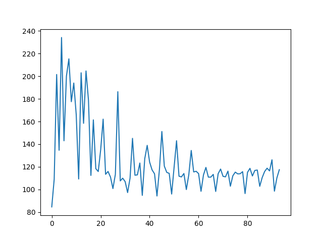

# CarND-Controls-PID
Self-Driving Car Engineer Nanodegree Program
,

---

## Build for driving normally(without training)  - it's default
Uncomment below line in main.cpp        
  #define  RUN_NORMAL        

1. Clone this repo.
2. Make a build directory: `mkdir build && cd build`
3. Compile: `cmake .. && make`
4. Run it: `./pid`. 

## Build for training 
comment below line like this.   
  //#define  RUN_NORMAL

Following build processure is the same as before.     

You may save the debug output like this.  
./pid > training_out.txt


## Reflection
P means the distance between correct line and my car. Using it,,we can reduce the error by changing steering angle. However, we may encounter zigzag driving because there must be some delay in getting angle and giving the command to the car. D controler is trying to solve this problem. It use the difference between previous error and current one.  
Sometimes, cars  steering angle system has some bug.Even if we gave the correct angle, the car may move uncorrectly, I controler figure out this problem. It sums up all errors and use it to fix the problem.     

I used twiddle and manual tuning. You can be sure that my twiddle algorithm works by following graph. The error is getting smaller.  However, I found out it's not easy to find optimal solution by twiddle in this project(yeah.. maybe there must be a better way...). Because the car is sometimes stopped and driving in the forest or water.
I found the optimal parameter by manual tuning.   
When I was implementing twiddle,I had a hard time to work with the simulator. I tried to leave enough comments in my code.    enjoy!


## training error graph
I saved output in training_out.txt   
I extracted error value and saved err_plot.py     

cat training_out.txt | grep "err:" | sed 's/.*err://g' > err_plot.py     

I edited err_plot.py  like this.   


```python
 import matplotlib.pyplot as plt

 
 d =[ 84.6093, 109.133, 201.554, 134.647, 234.211, 143.018, 200.184, 215.359, 177.552, 194.005, 166.131, 109.276, 203.056, 158.425, 204.677, 179.055, 112.416, 161.476, 118.412, 115.857, 135.287, 162.108, 113.406, 115.918, 111.011, 100.813, 113.42, 186.36, 107.591, 109.98, 106.934, 97.2728, 110.032, 145.151, 112.587, 112.937, 123.356, 94.7988, 127.151, 138.957, 124.147, 117.283, 113.875, 94.2549, 117.556, 151.202, 120.664, 115.101, 114.233, 95.9766, 119.674, 143.055, 111.723, 111.097, 114.108, 99.9551, 112.907, 134.444, 115.499, 116.069, 114.042, 98.3953, 112.84, 119.484, 110.899, 110.909, 113.326, 98.2685, 113.926, 118.04, 111.615, 111.151, 116.227, 102.876, 112.067, 115.324, 113.782, 113.915, 115.734, 96.4004, 115.15, 118.663, 111.943, 116.83, 117.178, 102.82, 110.529, 115.891, 118.811, 116.422, 126.209, 98.5254, 110.181, 117.495 ]
 
 plt.plot(d)
 plt.show()
```

following graph is the result.


